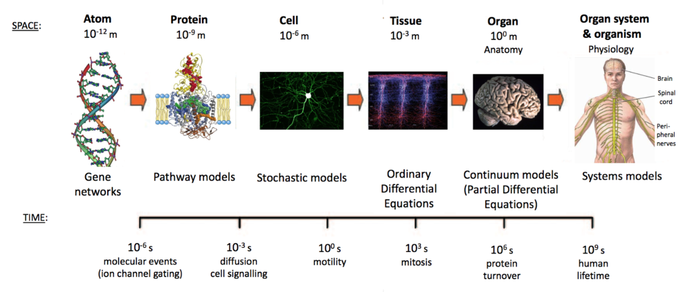

# ELMED219x

**Note:** Most of the course material is in Norwegian. You can find translations of some of the material in the branch `English` of this repository.

Dette er repositoriet til kurset [ELMED219: Introduction to Computational Medicine and Biomedical Engineering](https://www.uib.no/emne/ELMED219), et samarbeid mellom Institutt for biomedisin, Universitetet i Bergen, og Institutt for data- og realfag, Høgskulen på Vestlandet. . 

Her finner du kode og dokumentasjon til kurset. Mer informasjon finner du på Mitt UiB / Canvas: https://mitt.uib.no/courses/15237.

**Gå til [Sett opp din maskin](setup.md) for å komme i gang.**

Tips: For å gå gjennom kursets notebooks interaktivt uten å måtte laste ned programvare kan du bruke https://mybinder.org/v2/gh/MMIV-ML/ELMED219x/master.

# Notebooks
Kurset baserer seg på Jupyter Notebook, et web-basert rammeverk for å utvikle og presentere kode-baserte prosjekter (ta en titt på https://youtu.be/HW29067qVWk og https://youtu.be/2eCHD6f_phE for introduksjoner til Jupyter Notebooks). 

Gjennom kurset vil du arbeide med notebooks som inneholder diverse materiale og kode-oppgaver. Vi anbefaler at du lager kopier av våre notebooks før du editerer dem. Følg gjerne navngivningen `my_[name_of_notebook].ipynb`. 

## Kom i gang
* [Python, Numpy, Pandas, Matplotlib, Nibabel og mer](notebooks/0.0-test.ipynb): kjør gjennom denne notebooken for å teste at du har satt opp dine omgivelser korrekt.

