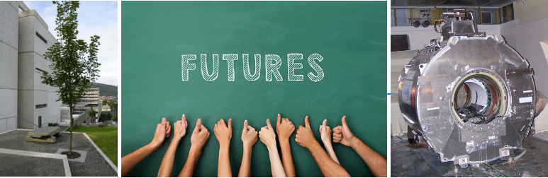

# ELMED219x
This is the course repository for [ELMED219: Introduction to Computational Medicine and Biomedical Engineering](https://www.uib.no/emne/ELMED219), a collaboration between the Dept. of biomedicine at the University of Bergen and the Dept. of Computing, Mathematics and Physics at Western Norway University of Applied Sciences. 

Here you'll find code and documentation for the course. The course site on Canvas / Mitt UiB has more information: https://mitt.uib.no/courses/15237.

**Go to [Set up your computer](setup.md) to get started.**

# Course Notebooks
The course will be based on Jupyter Notebook, a web-based environment for creating and presenting code-based projects (have a look at https://youtu.be/HW29067qVWk and https://youtu.be/2eCHD6f_phE for introductions to Jupyter Notebooks). 

Throughout the course you'll work on notebooks containing various prepared material and coding exercises. We recommend that you make copies of our notebooks before editing them, following the naming convention `my_[name_of_notebook].ipynb`. 

## Table Of Contents

*More be added*

### Getting started
* [Python, Numpy, Pandas, Matplotlib, Nibabel and more](notebooks/0.0-test.ipynb): run through this notebook to test that your environment is set up correctly

